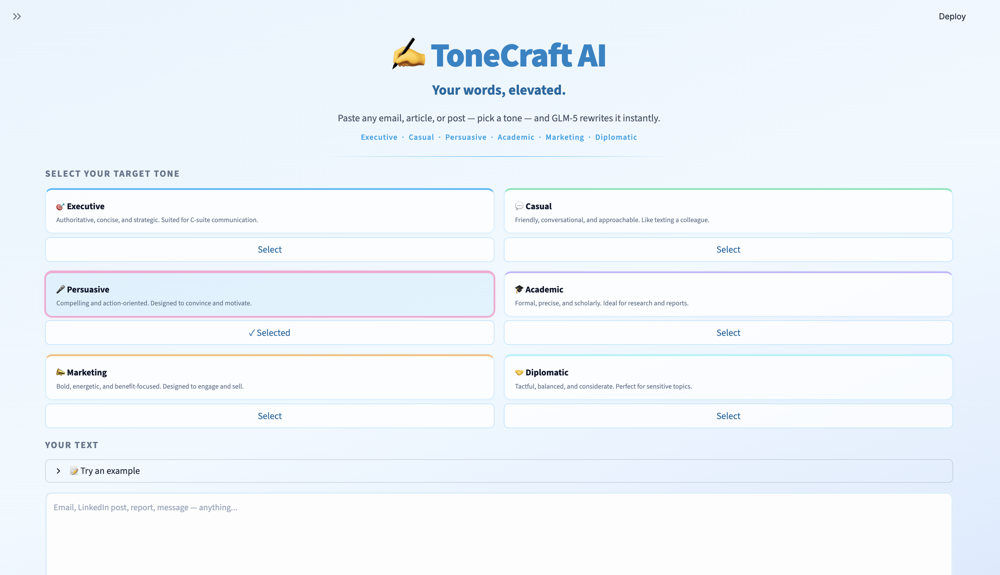
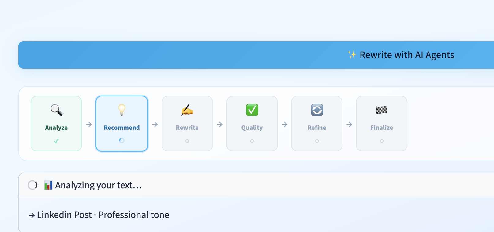
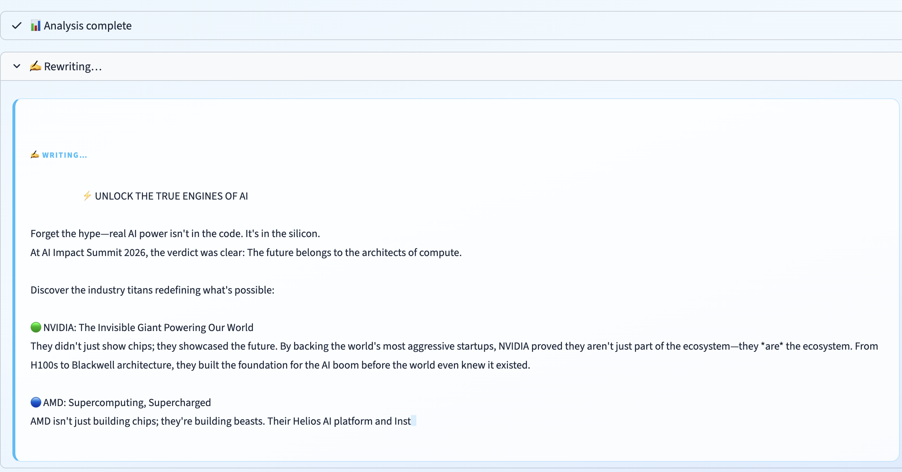
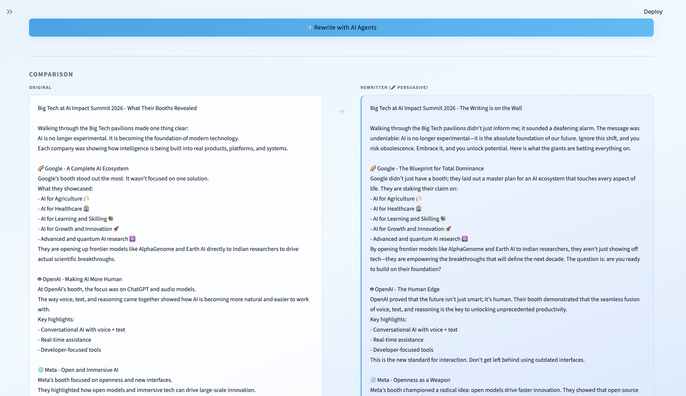
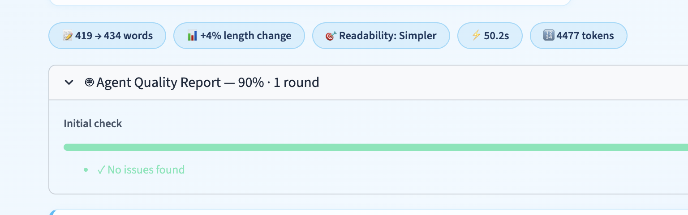
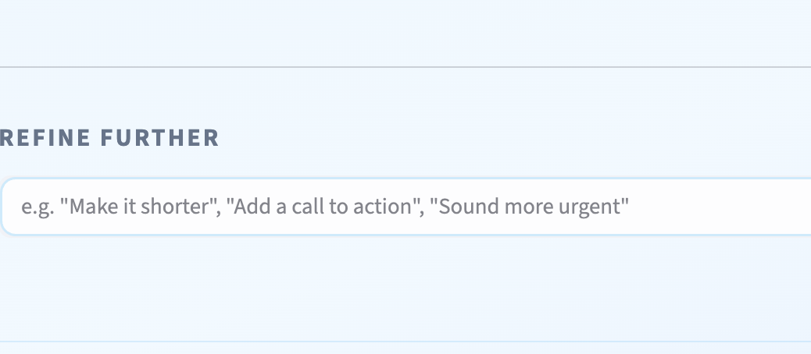
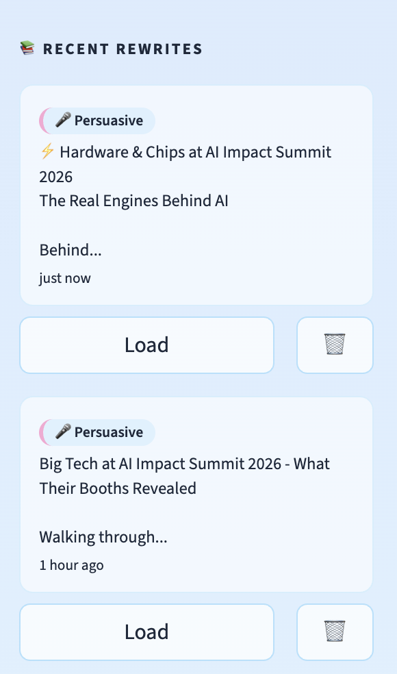

<div align="center">


# ToneCraft AI ✍️

**Your words, elevated.**
Paste any text, pick a tone — a 6-node AI agent pipeline rewrites it, checks quality, self-corrects, and explains every change.

<br>

[](https://www.python.org/)
[](https://streamlit.io/)
[](https://github.com/langchain-ai/langgraph)
[](https://zhipuai.cn/)
[](https://qubrid.com)
[](LICENSE)

</div>

---

## What it does

ToneCraft AI is a fully agentic text rewriting assistant. It doesn't just call an LLM once — it runs a **6-node LangGraph pipeline** that analyzes your text, recommends the best tones, rewrites with full context awareness, scores the quality, self-corrects if needed, and produces a detailed explanation of every change made.

Every rewrite is a multi-agent decision, not a single prompt.

---

## ✨ Features

### Core
- **✍️ 6 Tone Profiles** — Executive · Casual · Persuasive · Academic · Marketing · Diplomatic — each with a purpose-built instruction prompt.
- **📊 Side-by-Side Comparison** — original vs rewritten with word count delta and readability change.
- **📖 Explanation of Changes** — the agent explains exactly what was changed and why.
- **📚 Full Session History** — every rewrite is persisted to SQLite and reloadable from the sidebar with one click.
- **💬 Multi-Turn Chat Refinement** — after any rewrite, chat with the AI to further refine: "make it shorter", "add urgency", "change the opening".
- **🌧️ Stormy Morning Theme** — sky blue, lavender, and mint — dark and clean.

### Agentic
- **🔍 Intent Analyzer** — detects the content type (email, article, tweet, report…) and current tone of your input.
- **💡 Tone Recommender** — suggests the top 2 target tones based on what you wrote and what you're trying to achieve.
- **⚡ Live Token Streaming** — the rewrite streams token-by-token so you see it being written in real time.
- **🏆 LLM Quality Checker** — a dedicated agent scores the rewrite (0–100%) for meaning preservation and tone accuracy.
- **🔄 Auto-Refinement** — if quality score < 75%, the pipeline automatically re-rewrites with specific issue guidance, up to 3 attempts.
- **📈 Agent Pipeline Tracker** — a live visual shows all 6 agents: pending → active → done → skipped, updating in real time.
- **📋 Quality Report** — expandable breakdown showing per-round scores, progress bars, and flagged issues.

---

## 📸 Screenshots

### 🏠 Home — Text Input + Tone Selector


*Paste any text, pick a tone from the selector, and hit Rewrite. The agent pipeline fires immediately.*

---

### 🤖 Live Agent Pipeline Tracker


*All 6 agents are visualized in real time — each node lights up as it runs, greys out when done, and skipped nodes (like Refine when quality passes) are marked clearly.*

---

### ⚡ Live Token Streaming


*The rewrite streams live token-by-token. Watch the text be written in real time inside the status panel.*

---

### 📊 Results — Side-by-Side Comparison


*Original and rewritten text side by side. Metadata badges show detected content type, input tone, quality score, and whether auto-refinement was triggered.*

---

### 📈 Quality Report


*Expandable quality breakdown showing per-round scores, progress bars, and specific issues the quality agent flagged for each refinement attempt.*

---

### 💬 Multi-Turn Chat Refinement


*After the initial rewrite, continue refining via chat. "Make it shorter", "add a stronger call to action", "soften the opening" — the agent updates the rewrite and explains every change.*

---

### 📚 Session History Sidebar


*All rewrites and their chat threads are persisted in a local SQLite database. Load any past session instantly — including the full chat history.*

---

## 🤖 How the Agent Pipeline Works

Every rewrite runs a **6-node LangGraph graph**. The pipeline is split into three phases for live streaming:

```
Input Text + Target Tone
        ↓
[Phase 1 — Analysis Graph]
  analyze_intent   →  detects content type + current tone
  recommend_tones  →  suggests top 2 target tones with reasons
        ↓
[Phase 2 — Live Streaming Rewrite]
  stream_rewrite_tokens  →  rewrites token-by-token, streamed live to UI
        ↓
[Phase 3 — Quality Loop]
  check_quality  →  LLM scores rewrite 0–1 (meaning + tone accuracy)
       ↓ (if score < 0.75 and attempts < 3)
  refine         →  re-rewrites with specific issue guidance
       ↓ (loop back to check_quality)
  explain / finalize  →  promotes draft to final, locks result
        ↓
[Chat Graph — on demand]
  chat  →  applies follow-up refinement instructions from user
```

After the pipeline completes, the result, quality scores, and chat messages are all persisted to SQLite.

---

## 🤖 Agent Node Reference

| Agent | What it does |
|-------|-------------|
| **Analyze Intent** | Classifies content type (email, article, tweet, report…) and detects the current tone of the input. |
| **Recommend Tones** | Suggests the top 2 target tones with reasons, shown as clickable chips before you choose. |
| **Rewrite** | Core rewrite using the tone instruction + content type context. Streams live to the UI. |
| **Check Quality** | Dedicated LLM call scoring 0–1: meaning preserved, tone achieved, no hallucinations. Lists specific issues. |
| **Refine** | Re-rewrites with the quality issues passed as explicit correction guidance. Loops back to Check Quality. |
| **Finalize** | Promotes the draft to final output. Runs only when quality passes or attempts are exhausted. |

---

## 🎯 How It Works

1. **Paste** → Drop any email, post, report, or message into the text box.
2. **Pick a tone** → Choose from 6 profiles, or accept one of the AI's recommendations.
3. **Rewrite** → Watch the agent pipeline fire: analysis, streaming rewrite, quality check, and auto-refinement if needed.
4. **Review** → See the side-by-side comparison, quality score, metadata badges, and full explanation.
5. **Refine** → Chat to apply follow-up tweaks: shorten, harden, soften, redirect — as many turns as you need.
6. **Resume** → Every session is saved. Reload any past rewrite and continue the chat from exactly where you left off.

---

## 💡 What Makes This Different

Most rewriting tools are a single prompt wrapper. ToneCraft AI is an autonomous pipeline:

**1. The model checks its own work.** A separate quality agent scores every rewrite. If it doesn't pass, the pipeline automatically retries with targeted fix instructions — not the same prompt again, but a refined prompt built from the specific issues the checker found.

**2. You see the agents working.** The pipeline tracker shows every node in real time. You know exactly which agent is running, which passed, which was skipped, and why. There's no black box.

**3. The rewrite is a conversation.** After the initial pipeline, you can keep refining via multi-turn chat. The chat agent has the full original text, the current rewrite, and the complete message history — so every follow-up is contextually grounded, not a fresh start.

---

## 🛠️ Tech Stack

| Layer | Technology |
|-------|-----------|
| UI Framework | Streamlit + Custom CSS |
| Agent Orchestration | LangGraph 0.2+ |
| Language Model | GLM-5 (`zai-org/GLM-5`) |
| API Infrastructure | [Qubrid AI](https://platform.qubrid.com) |
| LLM Client | OpenAI SDK (Qubrid-compatible) |
| Database | SQLite3 |
| Dependency Management | `uv` |

---

## 📁 Project Structure

```
tone-craft-ai/
├── app.py                    # Streamlit entry point — 3-phase pipeline orchestration
│
├── agents/
│   ├── graph.py              # LangGraph graph definitions (analysis, rewrite, chat)
│   ├── nodes.py              # All 6 agent node functions + stream_rewrite_tokens
│   └── state.py              # ToneCraftState TypedDict
│
├── backend/
│   ├── api_client.py         # Qubrid streaming client
│   └── parser.py             # JSON parsing, diff stats, incremental streaming parser
│
├── config/
│   └── settings.py           # Model config, tone profiles, all agent prompts
│
├── database/
│   └── db.py                 # SQLite — rewrites + chat_messages, additive migrations
│
├── frontend/
│   ├── components.py         # All UI render functions incl. pipeline tracker + chat panel
│   ├── styles.py             # Stormy Morning CSS theme
│   └── assets/               # Banner, logo, screenshots
│
├── .env.example              # API key template
├── pyproject.toml            # UV dependency management
└── requirements.txt
```

**Where to look for what:**
- Edit tone profiles or agent prompts → `config/settings.py`
- Add a new agent node → `agents/nodes.py` + `agents/graph.py`
- Change the pipeline UI → `frontend/components.py` + `frontend/styles.py`
- Database schema → `database/db.py`

---

## 🚀 Quick Start

### Prerequisites

- Python 3.10+
- A [Qubrid AI](https://platform.qubrid.com) API key
- `uv` package manager (recommended)

### Installation

```bash
# 1. Clone the repository
git clone https://github.com/aryadoshii/tone-craft-ai.git
cd tone-craft-ai

# 2. Install UV package manager
curl -LsSf https://astral.sh/uv/install.sh | sh
source ~/.zshrc

# 3. Create and activate virtual environment
uv venv
source .venv/bin/activate  # macOS/Linux

# 4. Install dependencies
uv sync

# 5. Set up API key
cp .env.example .env
nano .env  # Add your QUBRID_API_KEY

# 6. Run the app
streamlit run app.py
```

### Fallback (pip)
```bash
pip install -r requirements.txt
streamlit run app.py
```

---

<div align="center">

**Made with ❤️ by Qubrid AI**

</div>
